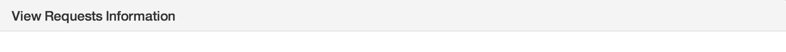
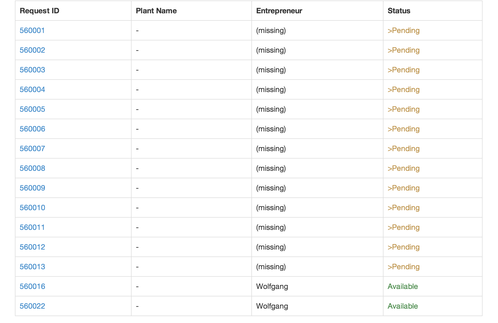
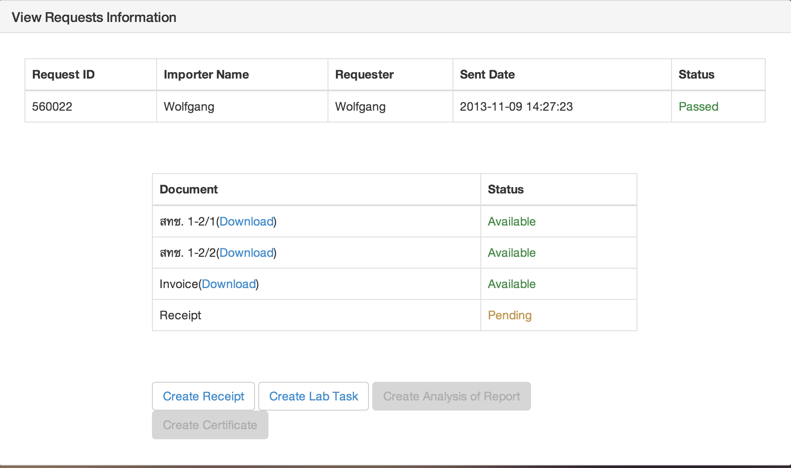

Use Case Name
-------------
Staff Check Certificate for entrepreneur

XRef
----
uc304

High Level Design
-----------------
In the First page there will be a table to show GMO staff that how many entrepreneur have send a request.
This page going to have only one component is in a 'Request ID' Coloumn to click to go to a ID that GMO staff want to go to.

In the second page after GMO staff click on ID that they want.
There will show a table what ID you're looking right now.
other table is show that how many Document is Available if GMO staff want to look to a document GMO staff has to click on a download.

Low Level Design
----------------
1.
--

  * In this Page user can only click on a ID that in a Requested ID column after click on a ID the application will take user to a next page(2).

2.
--

  * In this Page user can look up in each documents by click on a 'download' that in a brackets following the documents name.
