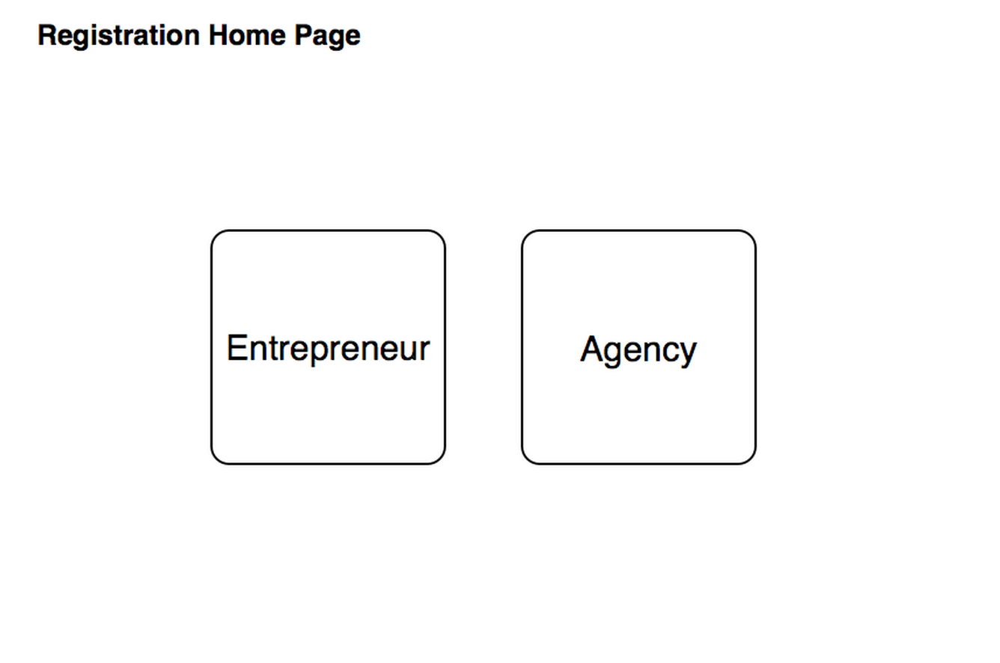

Use Case Name
-------------
Registration Home Page

XRef
----
uc101

High Level Design
-----------------
* At the beginning User (GMO Staff) will see a welcome page for registration, That have 2 big button “Entrepreneur” and “Agency”.
* User will select one of these two button (by click on the button) to choose that which type user want to create account.        
* User will move cursor on the top of each button, Bubble dialog will appear and show information about each account type.

Low Level Design
----------------

* Entrepreneur Button  
			-  Selecting Entrepreneur Button will direct user into entrepreneur registration/create page.        									           
* Agency Button			
			-  Selecting Agency Button will direct user into agency registration/create page.									
	
