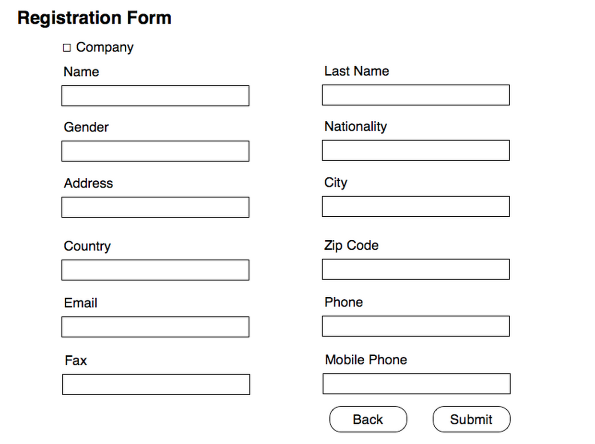

Use Case Name
-------------
Registration Form  

High Level Design
-----------------
* At the beginning User (GMO Staff) will see form to input registration information, included First Name, Last Name, Gender, Nationality, Address, City, Country, Zip Code, Email, Phone, Fax, and Mobile Phone. (Figure 5.1.2.P1)
* At the top of screen there’s the checkbox “Company” User will see another form input, included Name, Address, City, Country, Zip Code, Email, Phone, and Fax. (Figure 5.1.2.P2)
* After input information User will ciick on “Submit” button to submit input information and move on into next step. (5.1.3)
* When User click “Submit” button form will validate input data notify if User’s input is incorrect.
* User will cilick on “Back” button to reset all input information and go back to step 5.1.1.

XRef
----
uc101

Low Level Design
----------------

* Company Checkbox                                                            
      - Checking Company Checkbox will apply registration form into company registration form (Figure 5.1.2.P2)    
  
      - If user didn’t checking Company Checkbox registration will be person registration form (Figure 5.1.2.P1)
    
* Registration Form                           
      - If registration form is Company registration form, form will included                      
            + Name : Name of company                                                                      
            + Address : Address of company                                           
            + City : City where company located                                                        
            + Country : Country where company located                                                    
            + Zip Code : Zip Code where company located : Have to be only as number                                   
            + Email : Email of company : Have to be in Email formal                             
            + Phone : Telephone number of company                                                              
            + Fax : Fax number of company                                                                   
      - If registration form is Person registration form, form will included                   
            + Name : First Name of person      
            + Last Name : Last Name of person     
            + Gender : Gender of person : User will select only Male or Female      
            + Nationality : Nationality of person       
            + Address : Address where person lived     
            + City :      
            + Country :      
            + Zip Code :        
            + Email : Email of person     
            + Phone :      
            + Fax :        
            + Mobile Phone :     
* Submit Button    
      - Selecting Submit button will send input information into registration confirmation page, generate the
        username and password, and send the email containing the user information to the specified email address.
* Back Button     
      - Selecting Back button will cancel/clear all input information and redirect user back to registration home page.   

            

  
