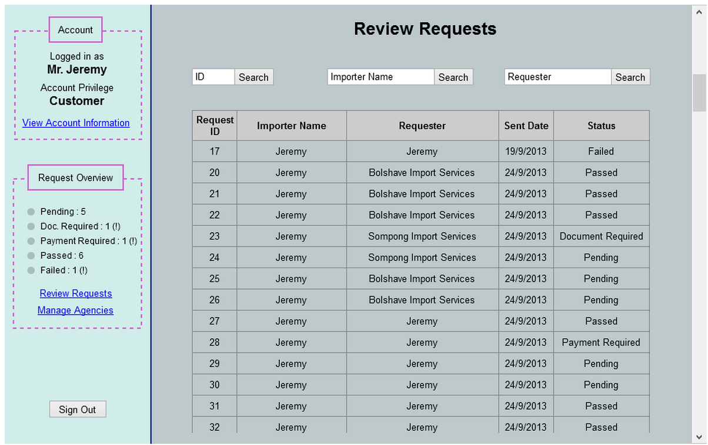

Use Case Name
-------------
 View All Request Status (This Cycle Homepage) 
 
XRef
----
uc104
 
High Level Design
-----------------
* Entrepreneur will be able to view a list of documents associated with a request by select a specific ID in Request ID row.
* Entrepreneur will also be able to search specific requests by either Request ID,Importer Name, or Requester.

Low Level Design
----------------

* Data Format
      - Request ID : Have to be only in number.
      - Importer Name, Requester Name : Have to be only in english alphabet.
      - Sent Date : Have to be in AD calendar date with format of dd/mm/yyyy.
      - Status : Have 5 stages either ‘Passed’, ‘Failed’, ‘Pending’, ‘Payment Required’, and ‘Document Required’
* Request Searching                                         
   Selecting ‘Search’ button will apply filter to the list according to which button and data entrepreneur has selected.
      - ID : The input must be number only.
      - Importer Name, Requester Name : The input must not have any numbers and special characters such as 1, 2, !, @, #, $, etc.
Searching with an invalid input will result in an error message pop-up.      
* Request Viewing
      - Whenever entrepreneur selects Request ID change panel to ‘Figure 5.2.2.A’.
