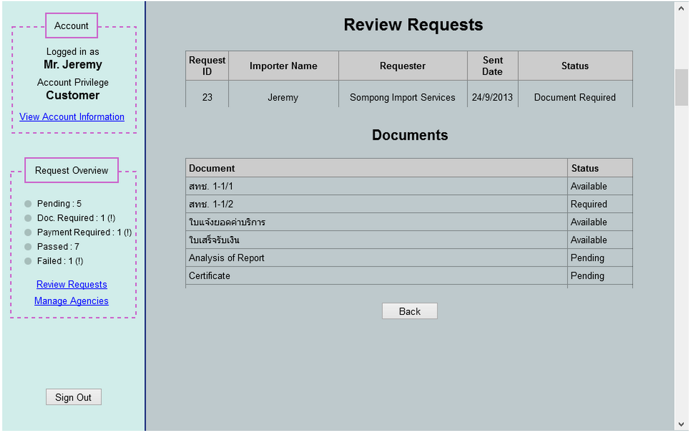

Use Case Name
-------------
View Request Information

High Level Design
-----------------
* Entrepreneur will now be able to view specific available document by selecting ‘Available’ status in the row respected to a desired document.
* Entrepreneur will be able to go back to request list by selecting ‘Back’ button.

Low Level Design
----------------

 

* Documents Table
      - Documents : Contain documents associated with selected request
            + Current documents available
            + สทช. 1-1/1
            + สทช. 1-1/2
            + ใบแจ้งยอดค่าบริการ
            + ใบเสร็จรับเงิน
            + Analysis of Report
            + Certificate for non genetically modified organism.
      - Status : Have 3 stages either Available, Required, and Pending
* Document Viewing
      - Whenever entrepreneur selects ‘Available’, send a download request of respected document. 
* Back Button
      - Change panel back to ‘Figure 5.2.1.A’.
