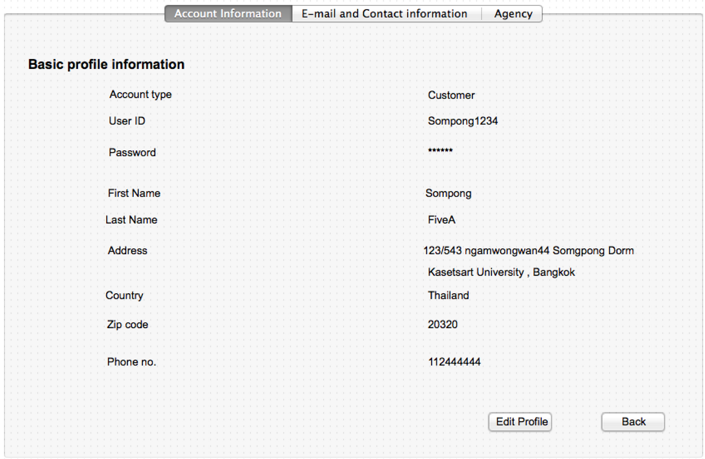

Use Case Name
-------------
Account Information Page

XRef
----
uc106

High Level Design
-----------------
* Entrepreneur will be able to view their information in this page , in this page have 2 buttons Edit Profile and Back.      
* Edit Profile Button will take Entrepreneur to a Edit Account Information Page(5.2.4)       
* Back Button will take Entrepreneur to a home page.     

Low Level Design
----------------

* Basic information 
      - Customer can’t change anything in this page , only view.
* Edit profile button
      - take customer to a Edit profile page(6.2.4).
* Back button
      - take customer to a previous page.
      

* Registered agency table
      - This table have 3 columns.
        1.Agency ID column show Agency ID to user.                   
        2.Agency name column show Agency name to user.                       
        3.Status column show Agency permission status to user.             

* Add button
      - Add button direct user to a add agency page(give agency a permission) on 6.2.6  
* delete button
      - delete button direct user to a revoke agency page on 6.2.6

