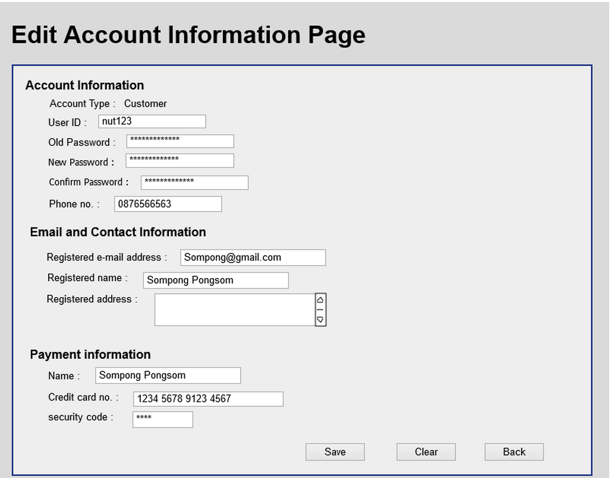

Use Case Name
-------------
 Edit Account Information Page

High Level Design
-----------------
* Entrepreneur will be able to edit their information in this page , in this page have 2 buttons save Profile and clear.
* Save button will take Entrepreneur to save Account Information Page and send to Edit Account Information Confirmation Page (5.2.5) 
* Clear button  will clear all information that Entrepreneur put in.     
* Back button will take Entrepreneur back to Account Information Page(5.2.3).      

Low Level Design 
----------------

* Data Format
      - Show all information header and its textbox.
* Save Button
      - Check Username and  Password is correctly.
      - Check New Password is the same as Confirm new Password(if you do not want to change your password leave it.).
      - Send all information to 6.2.5 Edit Account Information Confirmation Page.

* Clear Button 
      - Clear all data filled.
* Back Button
      - Redirect page to 6.2.3 Account Information Page.

 

