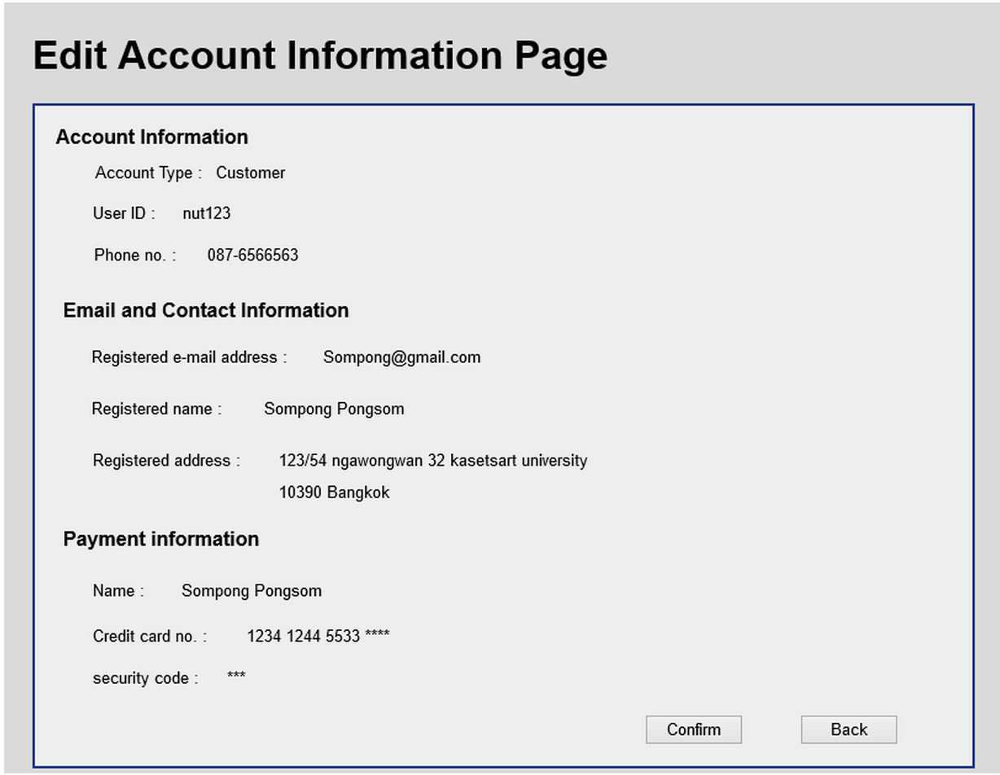

Use Case Name
-------------
Edit Account Information Confirmation Page 

XRef
----
uc102

High Level Design
-----------------

* Edit Account Information Confirmation Page will show all information that Entrepreneur want to edit and let them check for confirm.
* Confirm button will take system update all information.
* cancel button will take Entrepreneur back to Edit Account Information Page(5.2.4).

Low Level Design
----------------

* Data Format
      - All information in 6.2.4 has to show in label tag(read only).
      - Password information does not show.
* Confirm Button
      - Save all information into database and doing E-mail sending.
* Back Button
      - Redirect page to 6.2.4 Edit Account Information Page for changing some information.
* E-mail sending
      - All information include password will send to email.

