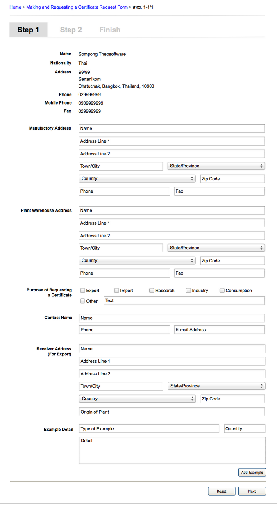

Use Case Name
-------------
Create Certificate Request Form

XRef
----
uc110

High Level Design
-----------------
* Entrepreneur will be able to fill in the information by type in textarea or select the information in combo box. (Some information system will fill in automatically)
* Entrepreneur will be able to reset the form by click “Reset” button. This button will delete all of the information that already filled in.
* Entrepreneur will be able to continue this process (go to Confirmation Page) by click “Next” button. This button will bring user to the Confirmation Page.

Low Level Design
----------------

Figure A.

Figure B.

* Data Format
      - Figure 5.2.7.A
            + Entrepreneur Information: This field will be query the information from database, so this field cannot edit.
            + Manufactory Address : Name, Address and Town/City are String. Zip Code, Phone and Fax are digits. Country and State/Province are combobox (the Entrepreneur only choose the existing information from the combobox).
            + Plant Warehouse Address : Name, Address and Town/City are String. Zip Code, Phone and Fax are digits. Country and State/Province are combobox (the Entrepreneur only choose the existing information from the combobox).
            + Purpose of Requesting a Certificate is a checkbox (Export, Import, Research, Industry, Consumption and Other)
            + Contact Name : Name and E-mail are string. Phone is a digits.
            + Receiver Address (For Export) : Name, Address, Town/City and Origin of Plant are String. Zip Code, Phone and Fax are digits. Country and State/Province are combobox (the Entrepreneur only choose the existing information from the combobox).
            + Example Detail : Type of Example and Detail are string, Quantity is a digits.
      - Figure 5.2.7.B
            + Common Name : Name of Plant is a string.
            + Manufacturer or Shipper Address : This field will be query the information from database, so this field cannot edit.
            + Vendor or Consignee Address : Name, Address, Town/City and Origin of Plant are String. Zip Code is digits. Country and State/Province are combobox (the Entrepreneur only choose the existing information from the combobox).
            + Description of Product : Describe as a string.
            + Final Destination is a combobox of the Country.
            + Port of Entry or Embarking is a combobox of the State/Province.
* Reset Button
      - The Entrepreneur will be prompted “Are you sure you would like to reset this form ?”. This button will delete all information in a form.
*  Next Button
      - This button will only be enabled when the form is filled in correctly (doesn’t have any empty required field). When the Entrepreneur click “Next” the system will bring the Entrepreneur to Confirmation page.
*  Step Indicator
      - This indicator show that which step the Entrepreneur is.
* Add Example
      - This button will add a new group of example detail field.
