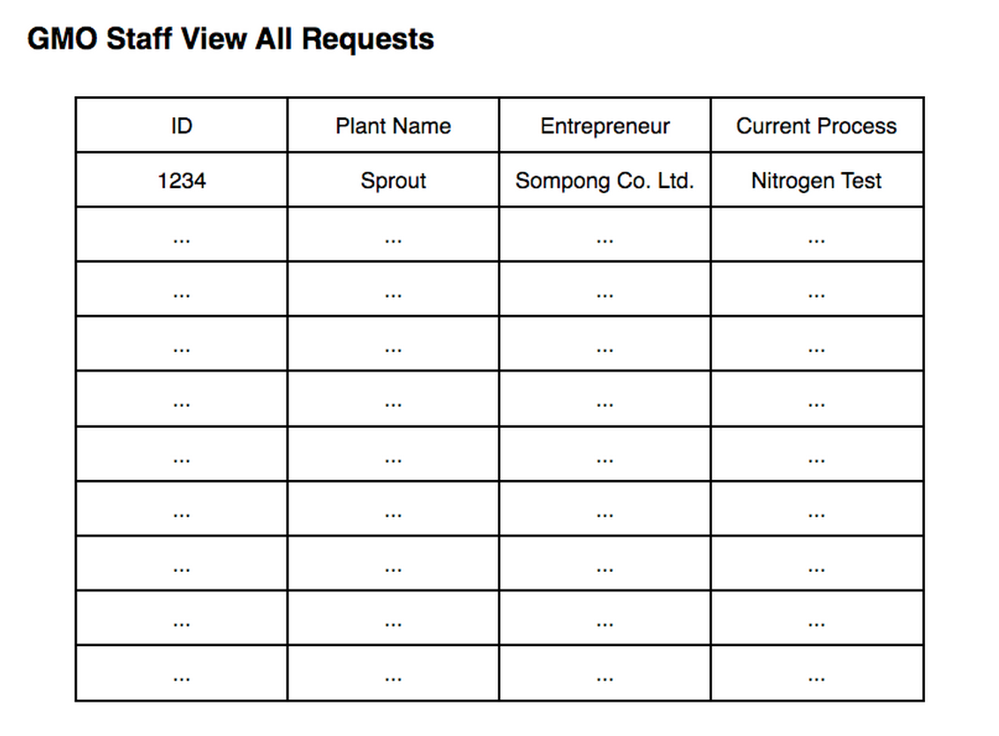

Use Case Name
-------------
View All Requests

XRef
----
uc111

High Level Design
-----------------
* User (GMO Staff) will see all current requests with some information, included Request ID, Request Plant Name, Entrepreneur, and Current Process
* User will click on head of the table to sort that column. For example User can click on ID to sort request by ID
* User will click on ID number to view that specific request information (step 5.3.2)

Low Level Design
----------------

