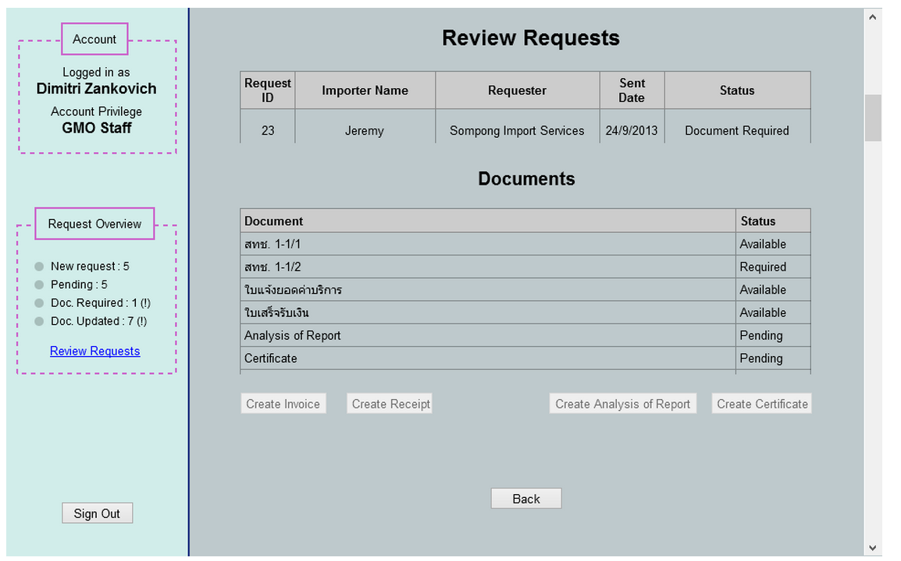

Use Case Name
-------------
View Request Information

XRef
----
uc112

High Level Design
-----------------
* GMO Staff will now be able to view specific available document by selecting ‘Available’ status in the row respected to a desired document.
* GMO Staff will be able to Create Invoice, Receipt, Analysis of Report, Certificate by pressing respected button.
* GMO Staff will be able to go back to request list by selecting ‘Back’ button.

Low Level Design
----------------

* Documents Table
- Documents : Contain documents associated with selected request
1 Current documents available
2 สทช. 1-1/1
3 สทช. 1-1/2
4 ใบแจ้งยอดค่าบริการ
5 ใบเสร็จรับเงิน
6 Analysis of Report
7 Certificate for non genetically modified organism.
- Status : Have 3 stages either Available, Required, and Pending
	* Document Viewing
- Whenever entrepreneur selects ‘Available’, send a download request of respected document. 
* Create Invoice Button
- Pressing the button will change panel to Create Invoice Form(5.3.3) , the button will be available only if the request status is in ‘Payment Required’ state and no any invoice of the same request ID existed.
	* Create Receipt Button
- Pressing the button will change panel to Create Receipt Form(5.3.4) , the button will be available only if the request status is in ‘Pending’ or ‘Document Required’ state and no any receipt of the same request ID existed.

	* Create Analysis of Report Button
- Pressing the button will change panel to Create Analysis of Report Form(5.3.5) , the button will be available only if the request status is in ‘Failed’ state and no any Analysis of Report of the same request ID existed.

	* Create Certificate Button
- Pressing the button will change panel to Create Certificate Form(5.3.6) , the button will be available only if the request status is in ‘Completed’ state and no any Certificate of the same request ID existed.
	* Back Button
- Change panel back to ‘Figure 5.2.1.A’.

