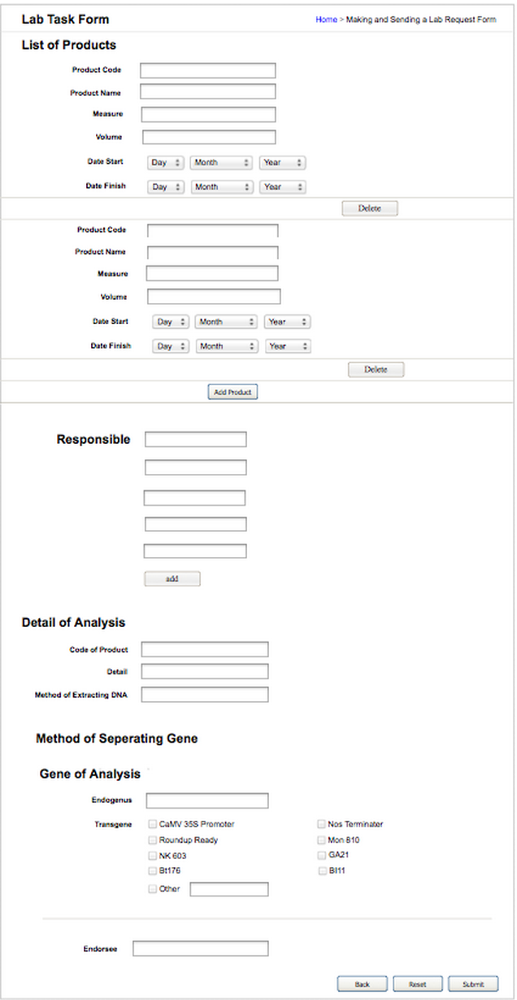

Use Case Name
-------------
Create Lab Task Form

XRef
----
uc110

High Level Design
-----------------
* GMO staff will fill the information of plant product.
* GMO staff will click add product button when they want to add product.
* GMO staff will click delete button when they want to delete a product from list.
* GMO staff can add the responsible by clicking add in responsible part.
* GMO staff will fill the detail of analysis.
* GMO staff will select the method of separating gene by checking the checkbox.
* GMO staff will fill in the gene of analysis part.
* GMO staff will fill the endorsee and select date.
* GMO staff will click submit button when they want to create lab task form.
* GMO staff will click reset button when they want to cancel creating lab task form.

Low Level Design
----------------

* Data Form
  - Product Code : code of each product.Code of product is digit.	
  - Product Name : name of each product. Name of product is String.
  - Measure : measure are digits.
  - Volume : volume are digits.
  - Responsible  : to add responsible who involved.
  - Method of Extracting DNA : fill the method that appropriate.
  - Endogenous  : to fill type of endogenous DNA.
  - Endorsee : this fill is for person who power to approve.
* Date 
  - GMO staff can click dropdown and select day,month and year.
* Delete button 
	- GMO can delete lab which was added by clicking delete button.It will delete productCode,productName,Measure,Volume,Date Start and Date Finish.When has only one product delete button will disable.

* Add Product button
  - GMO staff can add another lab by clicking add product button.It will duplicate productCode,productName,Measure,Volume,Date Start and Date Finish.
* Add button
  - GMO staff can add another responsible by clicking add button and write down the name of responsible.
	
* Method of Seperating Gene
  - GMO staff can select method by checking in checkbox.
* Transgene 
  - GMO staff can select transgene by checking in checkbox.
* Reset button
  - GMO staff can clear the lab task for by clicking reset button. 
* Submit
  - GMO staff can send the lab task form to lab by clicking submit button.
* Back
  - GMO staff can go back to previous page by clicking back button.

* General Info
  - The format of Common name and Description have to be in English language

* Create Certificate Button
  - The submit button will only be enabled for GMO Staff. This button is able to click when every fields in the form are completely filled.

* Cancel Button
  - The “Cancel” button will only be enabled for GMO Staff.  This button is able to click whenever GMO Staff wishes to clear all data in the form.  

