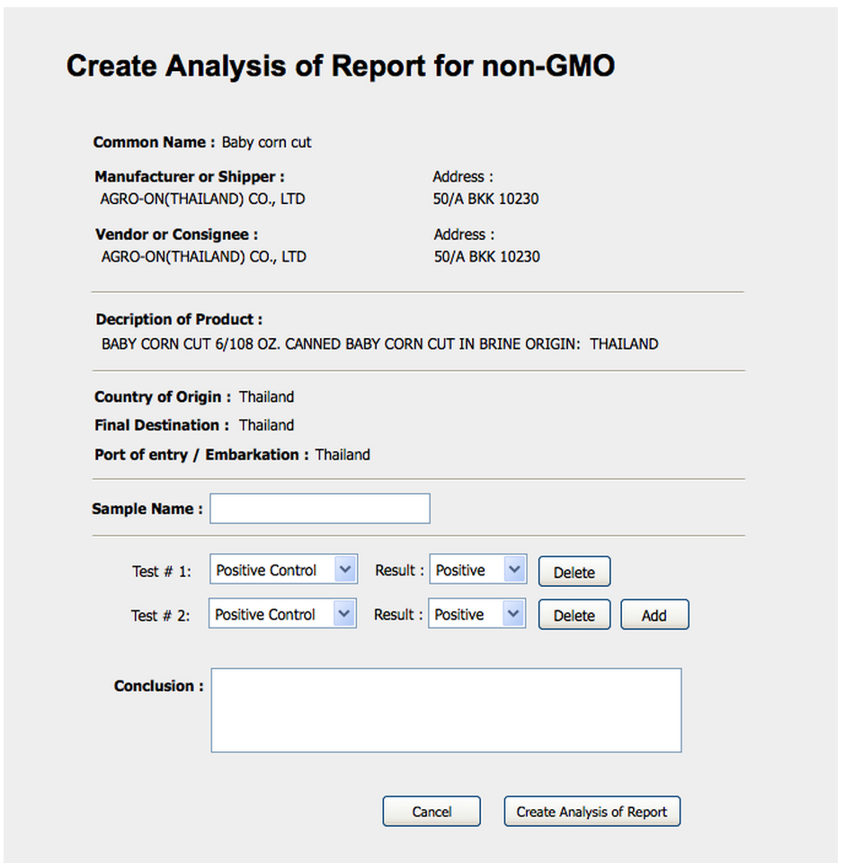

Use Case Name
-------------
Create Analysis Of Report

XRef
----
uc114

High Level Design
-----------------

* System will show all information from the request.
* GMO Staff will input the Sample Name of the test.
* GMO Staff will be able to add the test result by selecting the Test type from the drop down menu and selecting the Result of that test by the drop down menu.
* GMO Staff will be able to add more test result by selecting Add button.
* GMO Staff will be able to delete each specific test by selecting Delete button.
* GMO Staff will input the Conclusion of the test result in the text area.
* GMO Staff will be able to clear the form as well by clicking Cancel button.
* GMO Staff will be able to send the print request by clicking Create Analysis of button.

Low Level Design
----------------

* Data Format
  - All fields are non editable
    + Manufacturer or Shipper Information : Describes Name and Address as String
    + Vendor or Consignee Information : Describes Name and Address as String.
    + Description of Product : Describe as a string.
    + Final Destination describes the destination country.
    + Port of Entry or Embarking describes the State/Province.
* Test Result
  - Sample name : name of sample product as String.
  - Test Type : a combobox of the type of test.
  - Result : a combobox of the result of specific test type.
  - Remove : a button for removing the existing test. After GMO Staff clicked, it will delete that specific test. This button will be disabled when it has only one test in Test Result.  
  - Add Test : a button for adding new test. After GMO Staff clicked, it will appear another Test Type combobox and Result combobox.

* Back Button
  - When the GMO Staff click “Back” the system will bring the GMO Staff to previous page.
* Reset Button
  - This button will clear all data in fields.
* Create Analysis of Report Button
  - This button will let the system generates the Analysis of Report and shows it to GMO Staff which can preview and print. 
