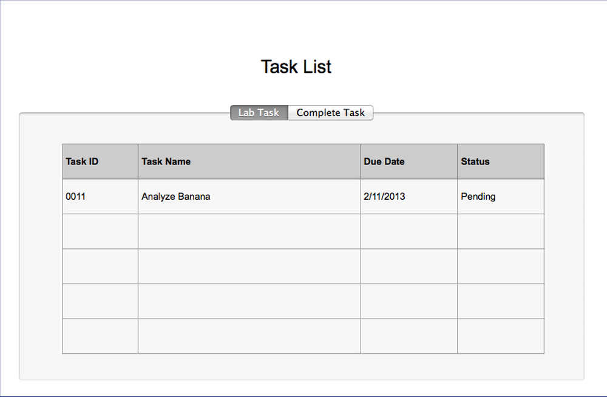

Use Case Name
-------------
View All Lab Task

XRef
----
uc117

High Level Design
-----------------

* Lab staff will be able to view all lab task in table

* Lab staff will be able to select to view specific request by clicking view button

* Lab staff will be able to view complete task by clicking complete task tab

Low Level Design
----------------

* Table Data Format
		- Task ID : Have to be only number. Clicking on task ID will show for specific task.
		- Task Name : Have to be only in english alphabet.
		- Due Date : Have to be in AD calendar date with format of dd/mm/yyyy. Clicking on table header of this column will sort task by due date.
		- Status : Have 3 stages either Pending, Analyzing, Complete. Clicking on table header of this column will sort task by status.
* Lab task tab
	  - Select this tab will present table show All incomplete lab task
		
* complete task tab
		- Select this tab will present completed lab task
