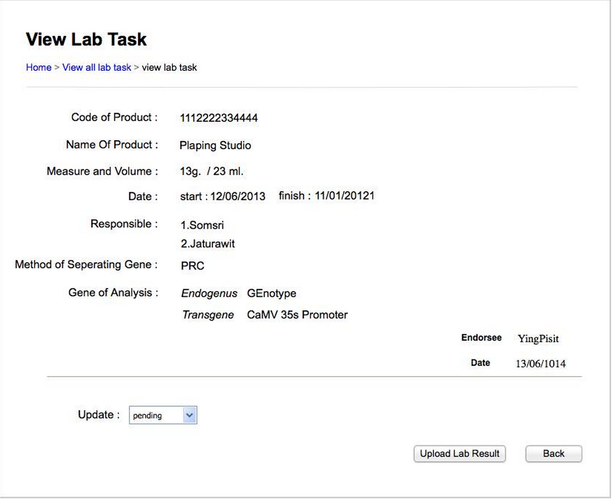

Use Case Name
-------------
View Lab Task

XRef
----
uc118

High Level Design
-----------------
* When lab staff select to view lab task it will show the detail of the lab task and it will show method how to perform lab.
* Lab staff update status of lab by selecting a status.
* Lab staff can upload a document by clicking a select button to find the directory of document and then click upload button to upload document.
* Lab staff will click back button when they finish reviewing.

Low Level Design
----------------

* Data Format
  - Upload Document a string that is a directory of the document.
* Update Status
	- Lab staff can change the status of lab by selecting a status
	-If log in as a head of the lab. It will show the complete button when he select “passed” status in update status.
* Find button
	-Lab staff can fill the the directory of document or they can find it by clicking a find button.
* Upload button
  - Lab staff will click upload button when they’ve already filled the directory of lab.	
* Complete button
	- this button will show when head of lab log in and the status of lab is “passed” . When lab staff click  complete button the system will notifies GMO-staff the lab’s decision on request.
* Back button
  - this page is for lab staff to view lab task and lab staff can click back button to back to view all of lab task.
