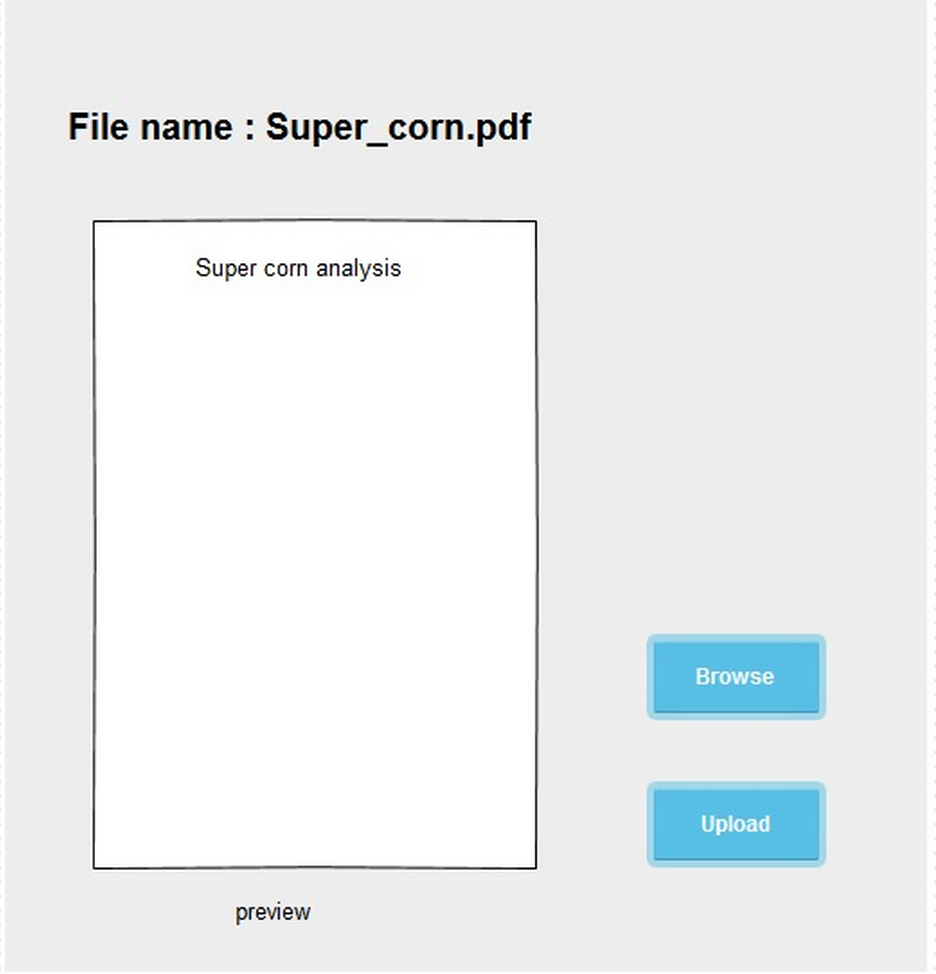

Use Case Name
-------------
Upload Lab Result

XRef
----
uc119

High Level Design
-----------------

After Lab Staff enters into file uploading page.
* Lab staff can select a file to proceed by click the ”Browse” button.
* “Browse” button presents the dialog that list files on the storage device.
* After Lab Staff choose a file, the system shows the name’s file and previews the first page of document.
* Lab Staff press the “Upload” button to proceed file uploading.

Low Level Design
----------------

* Browse button
  - This button present the dialog for user to select a file from directory.
  - The page will show a name’s file and preview a first page of document after selection.
* Upload button
  - This button performs an uploading the file to the server.
  - If the user does not choose a file yet, the system will not perform an uploading.  ( Appear warning message )
