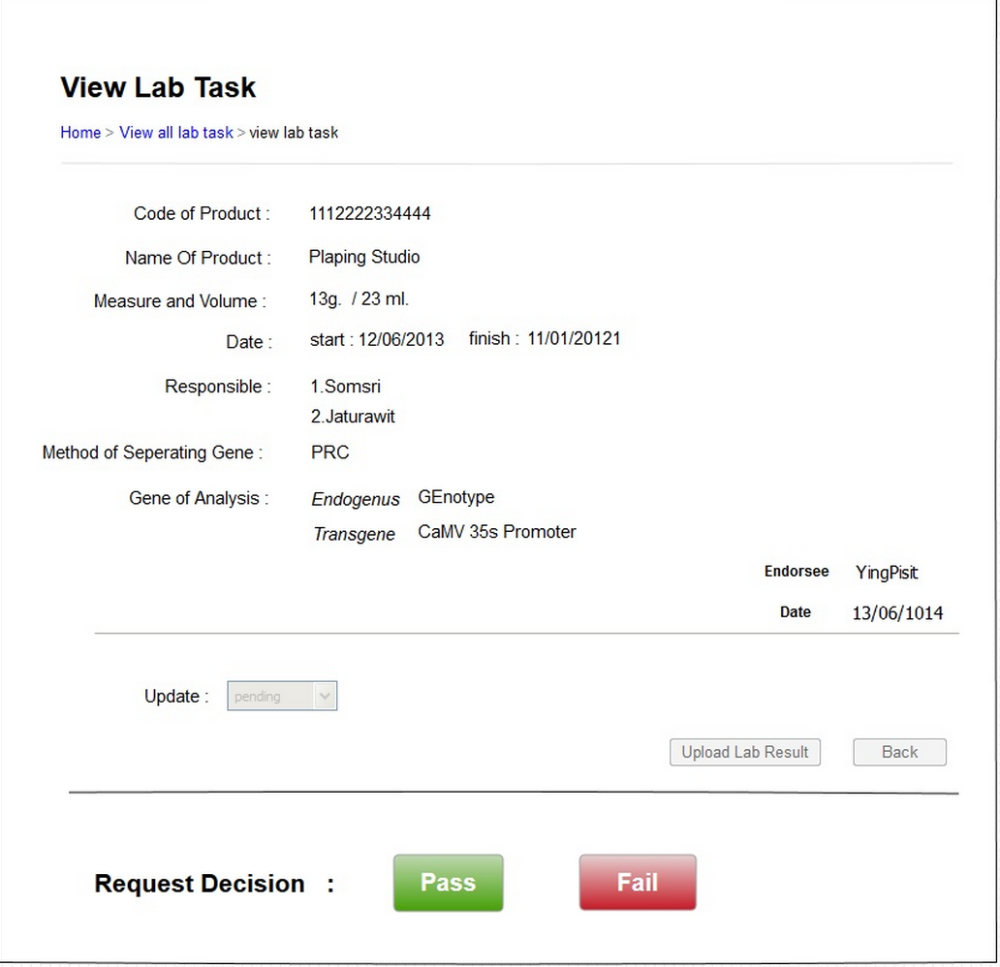

Use Case Name
-------------
Lab Request Completion Page

XRef
----
uc120

High Level Design
-----------------
  
After Head of the lab enter into the Lab request Info page
* ( From 5.4.2 ) The page presents information about the request. The “ Pass” and “ Fail” button appear to Head of the lab only.
* Head of the lab can press the “Pass” or “Fail” button to perform the decision of request.

Low Level Design
----------------

* Request decision panel
  - The appearance of the panel display to the Head of the lab only.
  - The components which is not contain inside this panel are set as Disable. 
* Pass button
  - This button performs the request get the permission.
* Fail button
  - This button performs the request does not get the permission.
