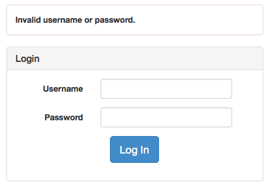

Use Case Name
-------------
Login

XRef
----
uc202

High Level Design
-----------------
There will be 4 components:

* Username field
* Password field
* Login button
* Error message panel (initally invisible)

The login button, when clicked, will check the user's credential and take the
user to appropriate home page. Otherwise, it will display the login form
again, but with error message panel visible.

Low Level Design
----------------

| Component Name             | ID               | Name      |
| -------------------------- | ---------------- | --------- |
| Login form                 | #login-form      |           |
| Username field             | #username        | username  |
| Password field             | #password        | password  |
| Login button               | #login-button    |           |
| Error message panel        | #login-errors    |           |

