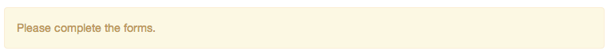
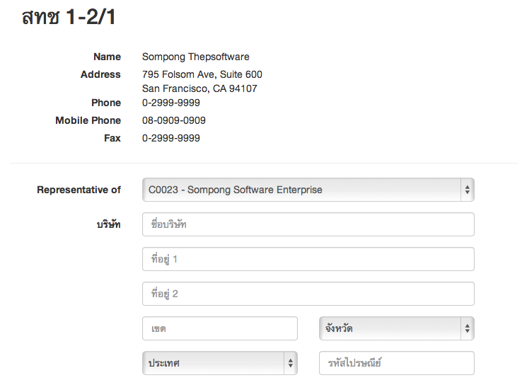
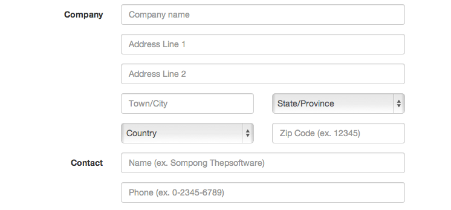
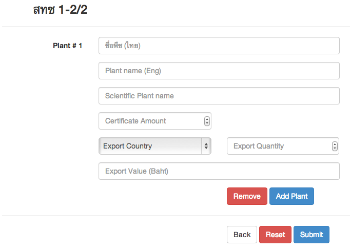

Use Case Name
-------------
Domestic Non-GMO Request Form (Customer)

XRef
----
uc302

High Level Design
-----------------
There will be 6 components:

* สทช 1-2/1 form
* สทช 1-2/2 form
* Reset button
* Back button
* Submit button
* Error message panel (initally invisible)

In สทช 1-2/2 form,
Remove button will be disable when there are exist one plant left. Otherwise, it can remove the specific plant.

The submit button,when clicked, will validate the form and take user to view all request page. Otherwise, it will display Domestic Certificate Request form again, but with error message panel visible.

Low Level Design
----------------

| Component Name            | ID                    | Name                  |
| ------------------------- | ----------------------| --------------------- |
| Domestic Request Form     | #dmt-req-form         |                       |
| Company Name (TH)         | #company-th           | company_th            |
| Address Line 1 (TH)       | #address-th           | address_th            |
| Address Line 2 (TH)       | #address-th2          | address_th2           |
| City (TH)                 | #city-th              | city_th               |
| Province (TH)             | #province-th          | province_th           |
| Company Name (Eng)        | #company-en           | company_en            |
| Address Line 1 (Eng)      | #address-en           | address_en            |
| Address Line 2 (Eng)      | #address-en2          | address_en2           |
| City (Eng)                | #city-en              | city_en               |
| Province (Eng)            | #province-en          | province_en           |
| Zip code                  | #zip                  | zip                   |
| Purpose                   | #purpose              | purpose               |
| Contact Name              | #contact-name         | contact-name          |
| Contact Number            | #contact-number       | contact-number        |
| Plant name (Thai) #X      | #plant-name-th-x      | plant_name_th_x       |
| Plant name (Eng) #X       | #plant-name-eng-x     | plant_name_eng_x      |
| Scientific Plant name #X  | #plant-name-sci-x     | plant_name_sci_x      |
| Certificate Amount #X     | #cert-amount-x        | cert_amount_x         |
| Export to #X              | #export-to-x          | export_to_x           |
| Export Quantity #X        | #export-qty-x         | export_qty_x          |
| Export Value #X           | #export-val-x         | export_val_x          |
| Add button                | #add-button           |                       |
| Remove button             | #remove-button        |                       |
| Back button               | #back-button          |                       |
| Reset button              | #reset-button         |                       |
| Error message panel       | #submit-errors        |                       |
