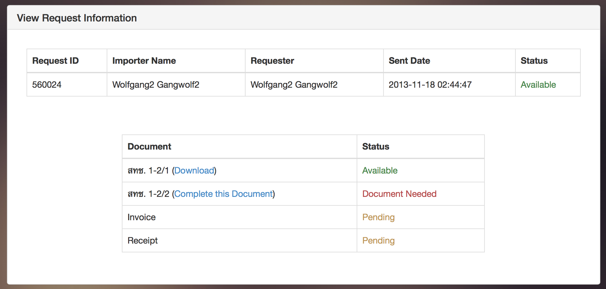

Use Case Name
-------------
Entrepreneur check Request status

XRef
----
uc303

High Level Design
-----------------
* Entrepreneur will be able to view request information.
* Entrepreneur will be able to view status of document related to this request.
* Entrepreneur will be able to download each document by click 'Download' link.
* Entrepreneur will be able to update each document by click 'Complete this Document' link.

Low Level Design
----------------

* Request Information table
    * Displays request information.
    * Columns
        * __Request ID__: Display the request ID from the database.
        * __Importer Name__: Display importer name from the database.
        * __Requester__: Display requester name from the database.
        * __Sent Date__: Display request send date from the database.
        * __Status__: Display request status from the database.
            * Approved: Request has been approved.
            * Pending: Request send and waiting for staff to approve, or decline.
            * Declined: Request has been declined.
* Request Document Information table
    * Display request related document status.
    * Sort by: Document, (สทช. 1-2/1, สทช. 1-2/2, Invoice, Receipt)
    * Columns
        * __Document__: Display name of document.
        * __Status__: Display status of document from the database.
            * Available: Document send and available to download.
            * Pending: Document send and waiting for staff to approve.
            * Document Needed: Document didn't send yet and need to upload.

| Component Name            | ID                    | Name                  |
| ------------------------- | ----------------------| --------------------- |
| Request Information table | #request-information-table |  |
| Request Document Information table | #document-information-table |  |
| Approved status text (Request) | .text-success |  |
| Pending status text (Request) | .text-warning |  |
| Declined status text (Request) | .text-danger |  |
| Available status text (Document) | .text-success |  |
| Pending status text (Document) | .text-warning |  |
| Document Needed status text (Document) | .text-danger |  |
