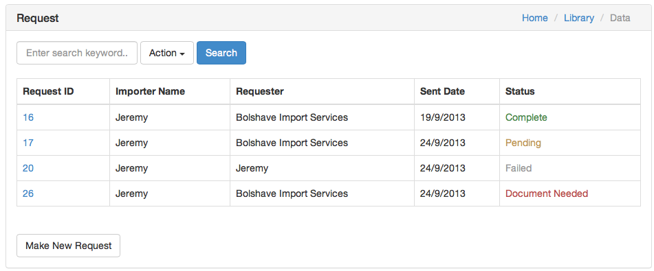
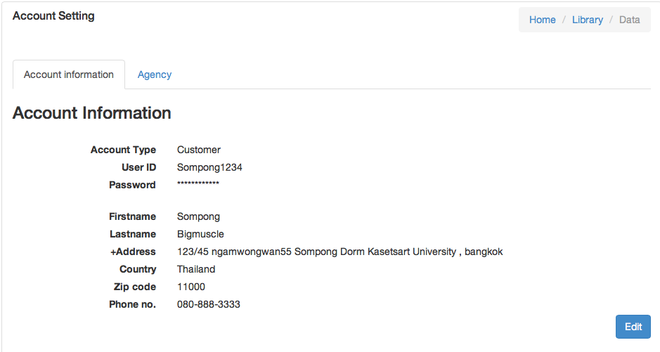
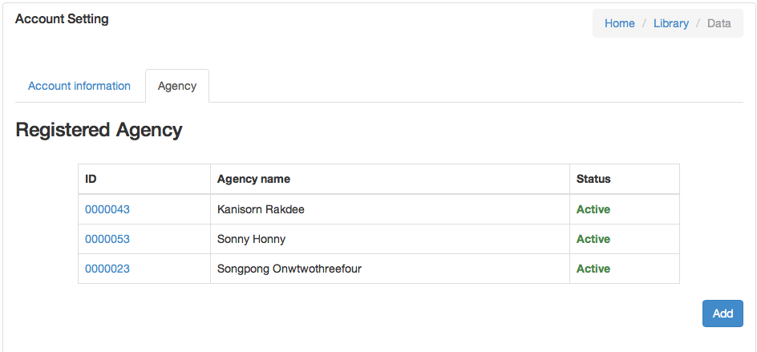
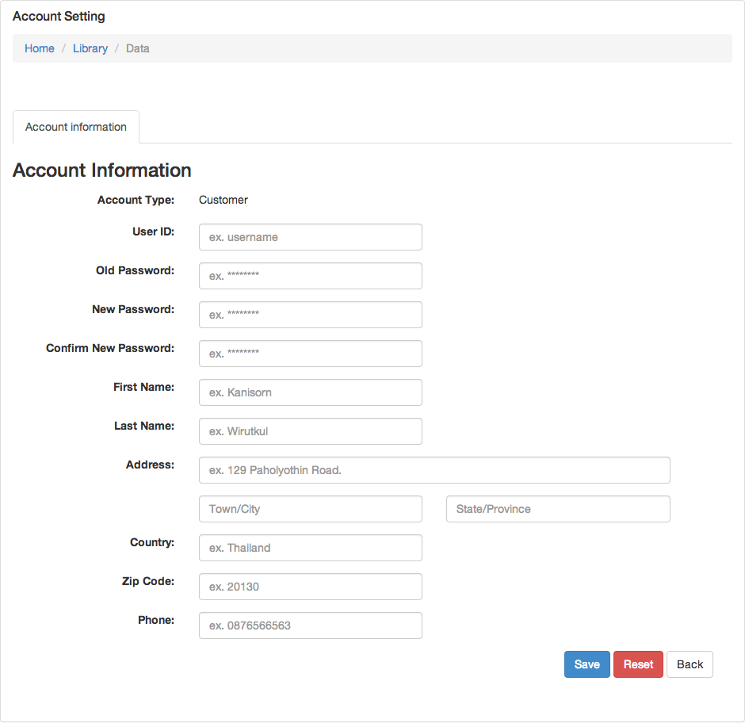
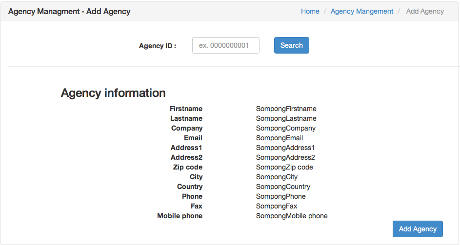
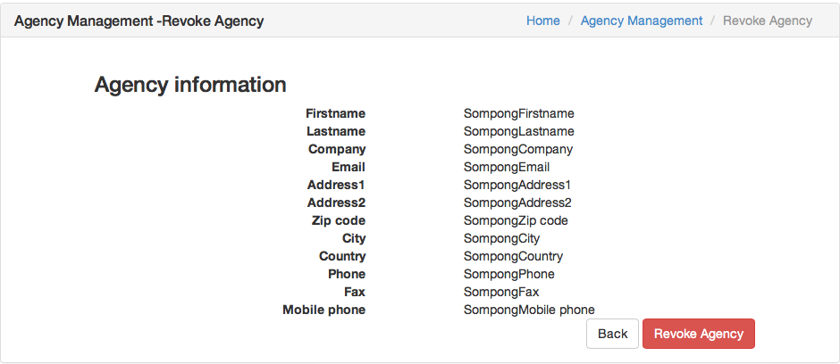
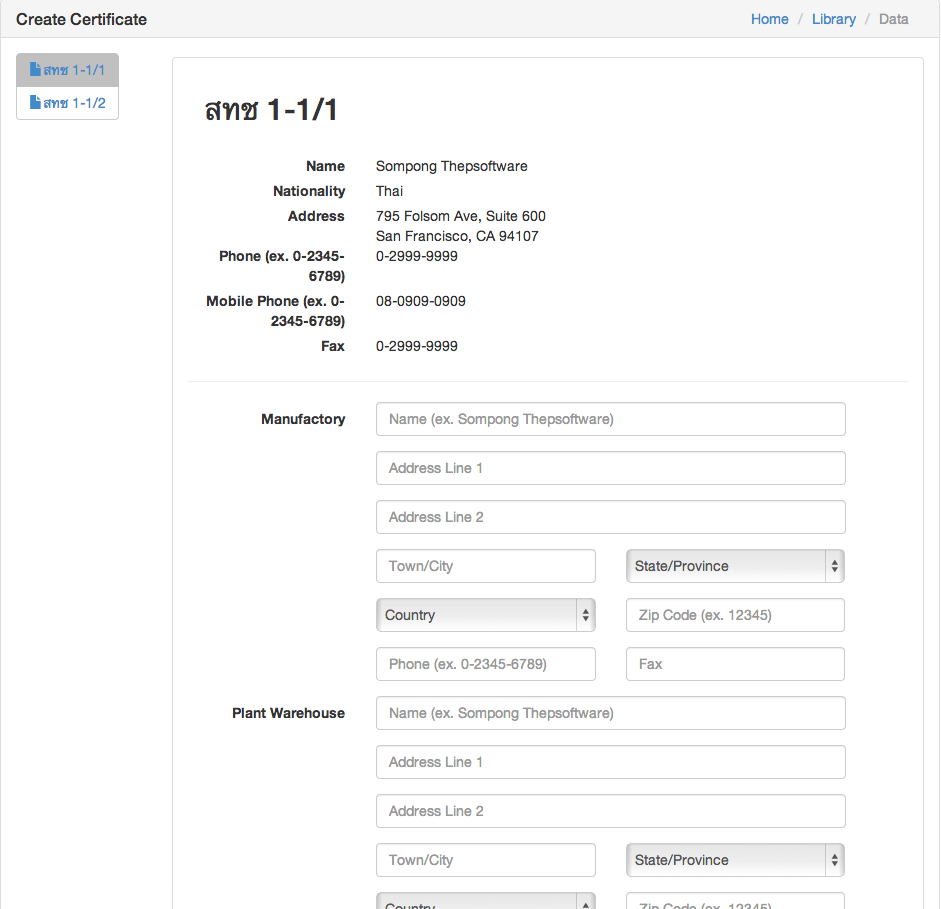
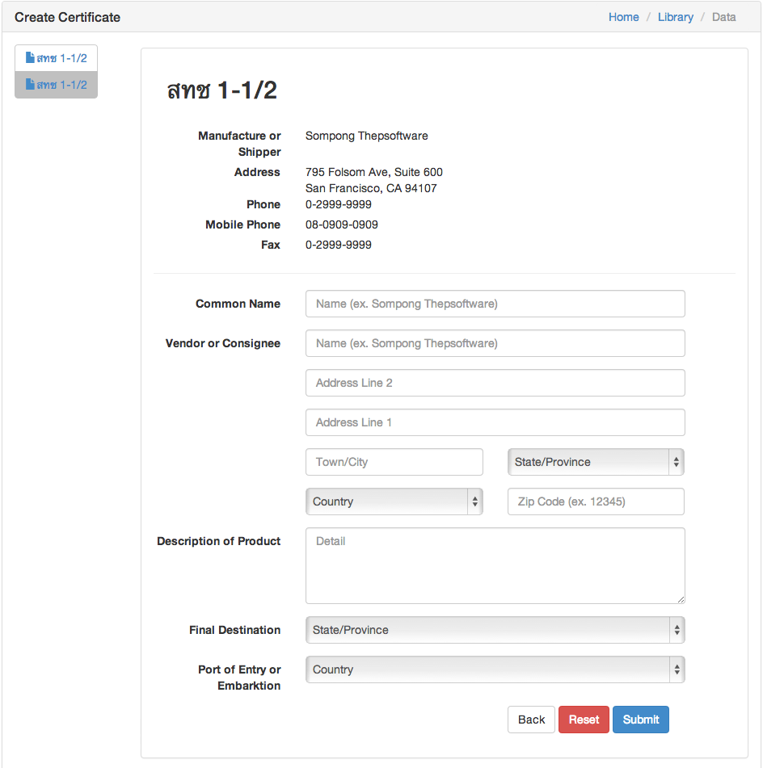

2. Entrepreneur
======

2.1 Getting Started <xref id="uc202" />
------

To start using GMO application, Open your browser and enter URL “http://gmo.tsp.dt.in.th/”. You will see login screen - figure 2.1.A.

Figure 2.1.A - GMO Login Page

Next step,  Fill-in your account information (username, and password). If input information is correct, go forward to step 2.2. But if your input is incorrect try enter login information again  or contact สทช. for help and more information.

2.2 View All Requested Status <xref id="uc105" />
------

In this step, after you logged you enter “view all requested page” - figure 2.2.A. In this page you will see all of your requests for certificate in simple and clean table. You can track request informations, and search for specific request by input keyword inside input box in the top. 

Figure 2.2.A - View All Requested

You can select/click on ID of specific request to view specific request information, see step 2.3. On the bottom of page you can click on “Make New Request” button to make a new certificate request, see step 2.7.

2.3 View Requested Information <xref id="uc107" />
------

In view specific requested information page - figure 2.3.A. In this page you will see more information of the selected request. In the bottom of page there is table of documents to this request, you can track its status and download them as .pdf, or word document file.

Figure 2.3.A - View Specific Requested

2.4 View Account Information <xref id="uc102" />
------

To view your account information click on account tab on page header, choose “User” from dropdown menu.

In view account information page you will see all your account information - figure 2.4.B, In the bottom of this page you can click on “Edit” button to edit your account information into step 2.5. Also you can see all dependency with you agencies - figure 2.4.C, you can click on ID of agency to manage specific agency, or click on “Add” button to add agency into step 2.6.

Figure 2.4.B - View Account Information (Account Tab)

Figure 2.4.C - View Account Information (Agency Tab)

2.5 Edit Account Information <xref id="uc102" />
------

In this edit account information page - figure 2.5.A, to edit account information fill-in all require information in form after you finished enter information. Click on “Save” button to finish the process. also you can click on reset button to reset data in form to the original one.

Figure 2.5.A - Edit Account Information

2.6 Manage Agency
------

### 2.6.1 Add Agency <xref id="uc103" />

After you click on “Add” button in step 2.4 you will see add agency page - figure 2.6.A. In this page you can enter your agency ID to search for agency, system will show agency information for you and you can click “Add Agency” button to add this agency.

Figure 2.6.A - Add Agency

### 2.6.2 Revoke Agency <xref id="uc104" />

After you click on ID of agency in step 2.4 you will see specific agency information page - figure 2.6.B thats show you agency information. You can click on “Revoke Agency” button to revoke this agency from your account.

Figure 2.6.B - View Specific Agency (Revoke Agency)

2.7 Create Certificate Request <xref id="uc106" />
------

In create certificate request page - figure 2.7.A. You need to enter/fill information for 2 forms สทช 1-1/1 and สทช 1-1/2. 

Figure 2.7.A - Create Certificated Request สทช1-1/1

Figure 2.7.B - Create Certificate Request สทช1-1/2

