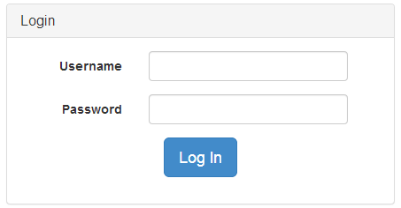
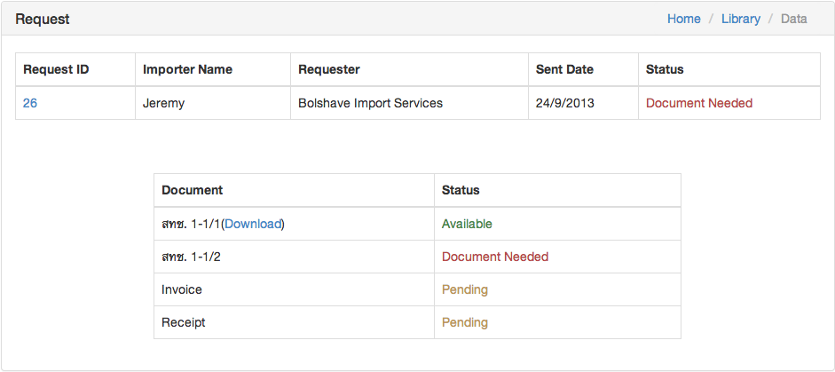

Entrepreneur
======

Getting Started
------

To start using GMO application, Open your browser and enter URL “http://gmo.tsp.dt.in.th/”. You will see login screen - figure 2.1.A.

Figure 2.1.A - GMO Login Page

Next step,  Fill-in your account information (username, and password). If input information is correct you’re go forward to step 2.2. But if your input is incorrect … or contact สทช. for more information and help.

View All Requested Status
------

In this step, after you logged you enter “view all requested page” - figure 2.2.A. In this page you will see all of your requests for certificate in simple and clean table. You can track some request informations, and also can search for specific information by input keyword inside input box in the top. 

Figure 2.2.A - View All Requested

You can select/click on ID of specific request to view specific request information, in step 2.3. On the bottom of page you can click on “Make New Request” button to make a new certificate request in step 2.7.

View Requested Information
------

In view specific requested information page - figure 2.3.A. In this page you will see more information for this request. In the bottom of page there is table for related documents in this request, that you can track its status and also can download its as .pdf, or word document file.

Figure 2.3.A - View Specific Requested

View Account Information
------

To view your account information click on account tab on page header, choose “View Account Information” from dropdown menu.

In view account information page you will see all your account information - figure 2.4.B, In the bottom of this page you can click on “Edit” button to edit your account information into step 2.5. Also you can see all dependency with you agencies - figure 2.4.C, you can click on ID of agency to manage specific agency, or click on “Add” button to add agency into step 2.6.

Figure 2.4.B - View Account Information (Account Tab)

Figure 2.4.C - View Account Information (Agency Tab)

Edit Account Information
------

In this edit account information page - figure 2.5.A, to edit account information fill-in all require information in form after you finished enter information. Click on “Save” button to finish the process. also you can click on reset button to reset data in form to the original one.

Figure 2.5.A - Edit Account Information

Manage Agency
------

### Add Agency

After you click on “Add” button in step 2.4 you will see add agency page - figure 2.6.A. In this page you can enter your agency ID to search for agency, system will show agency information for you and you can click “Add Agency” button to add this agency.

Figure 2.6.A - Add Agency

### Revoke Agency

After you click on ID of agency in step 2.4 you will see specific agency information page - figure 2.6.B thats show you agency information. You can click on “Revoke Agency” button to revoke this agency from your account.

Figure 2.6.B - View Specific Agency (Revoke Agency)

Create Certificate Request
------

In create certificate request page - figure 2.7.A. You need to enter/fill information for 2 forms สทช 1-1/1 and สทช 1-1/2. 

Figure 2.7.A - Create Certificated Request สทช1-1/1

Figure 2.7.B - Create Certificate Request สทช1-1/2

