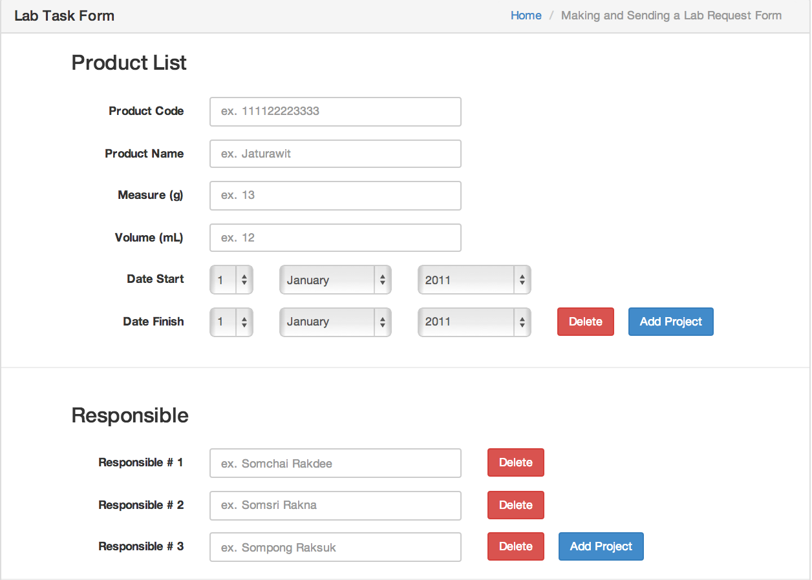

4. GMO Staff
======

4.1 Getting Started
------

To start using GMO application, Open your browser and enter URL “http://gmo.tsp.dt.in.th/”. You will see login screen - figure 4.1.A.

Figure 4.1.A - GMO Login Page

Next step,  Fill-in your account information (username, and password). If input information is correct you’re go forward to step 4.2. But if your input is incorrect … or contact สทช. for more information and help.

4.2 View All Request Page
------

Figure 4.1 - View all request 

* you can view all Requests from all the Entrepreneur and all the basic information (Figure 4.1)
* you can view specific request information by clicking on id in an ID column.

4.3 Review Requests
------

Figure 4.2 - Review Requests

* There are 3 statuses : 
    * Available : can download a document.
    * Pending : waiting.
    * Document Needed : All the documents are not turn in yet.

* You will be able to Create Receipt, Create Lab Task, Analysis of Report, Certificate by pressing respected button.
* To go back to view all request list clicks on the Back button.

4.4 Create Receipt
------

This page will show after click on a Create Receipt Button on a View all Review Requests Page. (Figure 4.2) 

Figure 4.3 - Create Receipt

* This page previews a ‘Receipt’ form before print.
* Click ‘Print’(blue button) to print a receipt.
* Click ‘Back’ to back to the view request page.

4.5 Create Analysis of Report Page
------

Figure 4.4 - Create Analysis of Report 

* System will show all information from the request.
* you have to fill the Test Result if have more than 2 Tests you can click on ‘Add Test’(Blue button) to add more test like Test # 3 and more.
* you can clear all the information in case type in wrong by clicking on a ‘Reset’(Red Button) to reset everything in text box.

4.6 Create Certificate Form Page
------

Figure 4.5 - Create Certificate Form 

This page fill everything like a previous page in Figure 4.4 but this page is about to create a certification form not analysis.

4.7 Create Lab Task Form Page
------

Figure 4.6 - Create Lab Task Form

* In this Lab Task Form page(Figure 4.6) you has to fill all the information that has 4 subject to fill in for GMO Lab staff and  this form will send to a GMO Lab staff.
* Product Lists
    * GMO staff has to fill in a product code, name,Measure,Volume,Date start ,Date Finish and GMO staff can add more product at one time by click on a ‘Add product’ button this will insert other product information to fill in.
* Responsible
    * This part is to fill a person who have responsibility in a product can add more than 1 person by click on a ‘Add project’ button and it will insert new text field to fill a person’s name.
* Detail of Analysis
    * Fill Product code,detail,Method of Extracting DNA and select Method of Seperating Gene.
* Gene Analysis
    * Fill Endogenous and select Transgene.
* After fill all the information in each part you can click on ‘Submit’ button to confirm and send all the data to a GMO Lab staff.
* ‘Reset’ button use to reset all the data in the page to BLANK.

