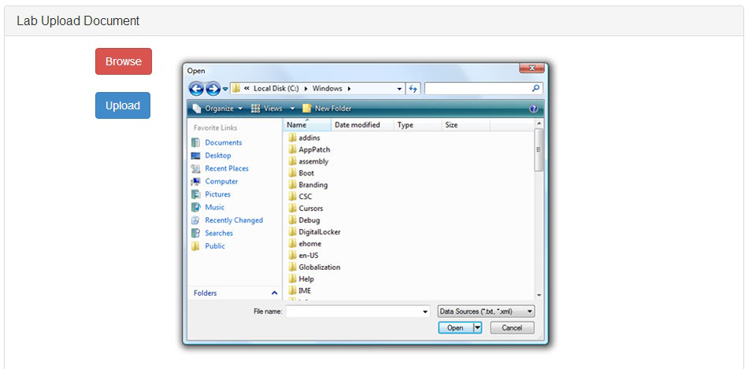

Lab Staff
======

This section explains how to use each features of Lab Staff user. 

View the List of All Lab Task
------

* Enter to the page by clicks on the Request list tab.
* The page will show list of all request. (Figure 5.1)
* You can see the ID of the task, Name of task, due date of task and status of the task that perform in which process.

Figure 5.1 - lab task list page

See the Info of Each Specific Lab Task
------

* Enter to the Lab task page.( From 5.1 ) Then clicks on the Task ID which you want to look its info.
* The page will bring you to lab’s info page. ( Figure 5.2 )
* You can see the details of the task such as product code, who take response, analyze method, endosee and the sequence of this analyzing.

Figure 5.2 - Task information

Upload the Lab's Info or Lab Result
------

* Enter to the page by click on Lab upload document tab.
* To upload your file, clicks Browse button to open file dialog and then choose a file that you want to upload. Only pdf or word file can be uploaded to the system. Then clicks Upload button to perform uploading. ( Figure 5.3 )

Figure 5.3 - document uploading

To Confirm the Lab Examination
------

* Only Head of the lab identity can perform this operation.
* First, Enter to the lab task page ( From 5.1 ), Then clicks on the Task ID which you want to perform verification of the task.
* At the end of the page of lab’s info task. ( From 5.2 ) If the identity is Head lab. This panel will appear for the Head lab only. ( Figure 5.4 )
* To performs verification, clicks Pass button to make that Lab task pass verification. Otherwise clicks Fail button to make that Lab task not pass verification.

Figure 5.4 - perform verification

